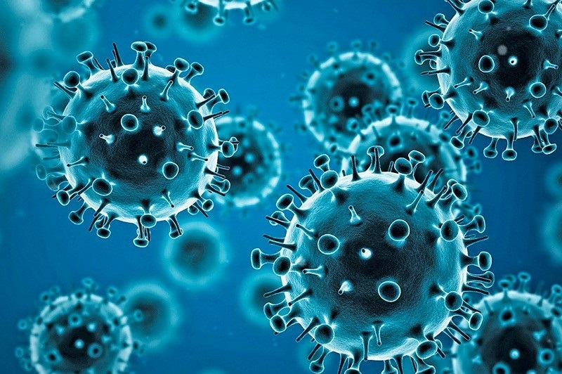
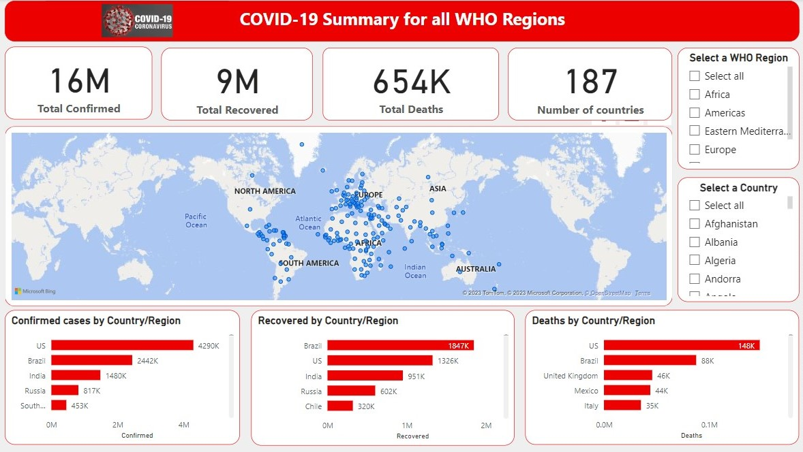

# COVID-19 Summary for all WHO Region

## Introduction 
This is a Power BI project on COVID-19 Summary Analysis for the World Health Organization (WHO) Regions. The project is to analyze and provide a comprehensive overview of COVID-19 confirmed cases, recoveries, and deaths by country/region, shedding light on the pandemic's different impacts worldwide. The COVID-19 pandemic has had a significant impact on global health and economies. 

**_Disclaimer_**: _This report is based on the available dataset uploaded on Kaggle.com 3 years ago. The COVID-19 situation is rapidly evolving, and new information may impact the analysis. I encourage readers to refer to authoritative sources for the most up-to-date information and guidance._ 

## Problem Statement 
1. What’s the total number of confirmed, recovered, and death cases?
2. Which Country/Region has the highest number of confirmed cases? 
3. Which Country/Region has the highest number of recovered cases?
4. Which Country/Region has the highest number of death cases?

## Skills/Concepts demonstrated
The following Power BI features were incorporated:
- DAX,
- New Measures,
- Filtering and slicing,
- Data visualization,
- Data Aggregation,
- Report storytelling,
- Insight Generation,
- Interactivity

## Dataset sourcing 
The dataset was downloaded from Kaggle.com. The dataset consists of confirmed COVID-19 cases, deaths, and recoveries. I organized the data by WHO country/region, which allowed to analyze the variations across different parts of the world.

## Modeling 
Data modeling isn't necessary because a table was used for the analysis.

## Visualization 
The reporting dashboard is below ;

You can interact with the report [here](https://app.powerbi.com/view?r=eyJrIjoiMjQyMzZkODctNDNjOC00YjM5LWJhNzEtM2FhMWU4YTlmY2MxIiwidCI6ImY1OWE1ZDBkLThmNDEtNGNhNS05MmE5LTI3MDM1ZjMwNDZiOCJ9)

## Analysis 

### Total confirmed cases
The total number of confirmed cases recorded was 16m

### Total Recovered cases
The total number of recovered cases recorded was 9m

### Total Death cases
The total number of death cases recorded was 654k

### Confirmed cases by Country/Region 
I analyze the total number of confirmed COVID-19 cases in each country/region using a clustered bar chart. The US had the highest number of confirmed cases followed by Brazil and the Western Sahara had the lowest number of Confirmed cases. The US accounted for 26.03 % of the Confirmed cases. Across all 187 Countries, the sum of Confirmed cases ranged from 10 to 4,290,259. The data revealed variations in infection rates, highlighting countries/regions with higher or lower-case counts. These insights contribute to a better understanding of the virus's spread across different parts of the world.

### Recovered by Country/Region

I examined the number of recovered COVID-19 cases in each country/region. Brazil had the highest recovery rate. Brazil accounted for 19.50 % of the recovered cases. Across all 187 Countries, the sum of Recovered ranged from 0 to 1,846,641. This analysis showcased the resilience of various regions in successfully managing and treating the disease. Understanding recovery rates contributes to our comprehension of the effectiveness of medical interventions and containment strategies.

### Deaths by Country/Region
The analysis delved into the total number of COVID-19-related deaths in each WHO region. The US had the highest number of deaths followed by Brazil. The US accounted for 22.63 % of the Death cases. Across all 187 Countries, the sum of Deaths ranged from 0 to 148,011.

## Results and Insights 

The analysis revealed disparities in the impact of COVID-19 across WHO regions. Some regions experienced higher infection rates but lower death rates, possibly due to varying healthcare capacities and response measures. Recovery rates varied across regions, suggesting differences in healthcare quality, treatment protocols, and public health strategies. This report emphasized the importance of a coordinated global response to pandemics, as well as the need for information sharing and collaboration among nations. By comparing death rates, I identified regions with higher mortality rates and those where healthcare systems effectively managed the crisis. These findings underscore the importance of robust healthcare infrastructure during a pandemic.

## Conclusion and Recommendations 

COVID-19 varies widely between countries and regions with some areas having higher numbers and rates than others. The causes of these variations are population density, travel and migration patterns, healthcare infrastructure, access to medical treatments and therapies, age and overall health of the population, and government response measures. The solution is to reduce the variations by preventing the spread of the virus, improving access to healthcare and treatments, and raising awareness about the virus and how to protect oneself and others.

